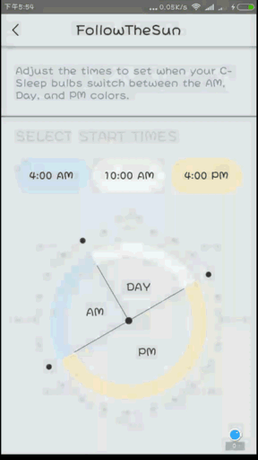

##控件简介
该控件是从公司GE蓝牙灯项目中抽取出来的，当时我花了一个下午的时间写了出来，用于设置蓝牙灯的三种时间段的大小，三种时间段分别为AM，PM，DAY。每种时间段对应一种状态，AM为白天白天时段，蓝牙灯关闭；PM为晚上时段，亮度较高，作为照明灯；DAY为凌晨睡觉时段，亮度较小，作为睡眠灯。

##效果展示

##部分效果
* 文字不会重叠：通过文本的Rect大小计算文本之间的距离
* 动画效果：使用ValueAnimator + TypeEvaluator

##大致实现
初始化方法中获取自定义属性，onMeasure函数中算出控件中心点横纵坐标，onDraw函数中画弧，画半径，画文本（这里为了节省绘制，圆的外部点圈作为控件父布局的背景图），最后通过ValueAnimator + TypeEvaluator来不断调用重绘。